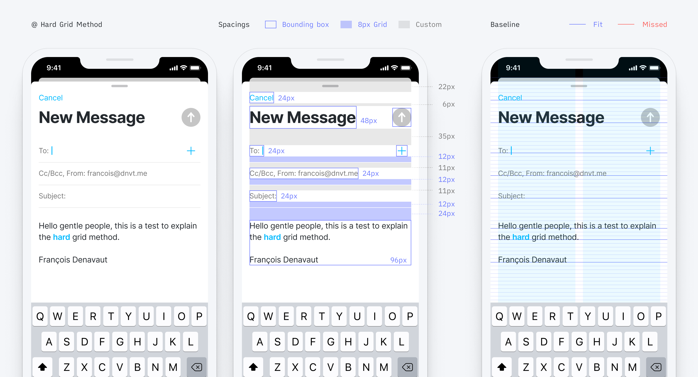

# Personal take on the 8px Grid systems – the hard grid method

## Why 8px grid?

Why is it becoming a rule to build a website and design system based on an 8px grid system?

- Help to manage pixel-perfect better
- It scales perfectly in all the different screen displays (including android's @0.75 and @1.5).
- Grid rhythm
- Google and Apple say so (Seems to be a best practice already in place)
- Simple multiple, easily divisible, and scalable

---

Some articles about it the subject, if you need to get some freshen up reminder:

- [The Comprehensive 8pt Grid Guide ↗️](https://medium.com/swlh/the-comprehensive-8pt-grid-guide-aa16ff402179)
- [Text Baseline ↗️](https://alistapart.com/article/settingtypeontheweb/)
- [From Google DS ↗️](https://www.designsystems.com/space-grids-and-layouts/)
- [Hard vs. Soft Grid method ↗️](https://medium.com/sketch-app-sources/hard-and-soft-8-point-grids-60cf803b9de4)

### Hard grid method

Everything snaps to a strict 8x8 pixel grid, and typography sits on a baseline.



### Soft grid method

Everything still follows the 8 point scale, but we remove the vertical baseline and horizontal adherence to a strict 8x8 pixel grid. The spacing between every element can become a multiple of 8 (note that 4 and 12px, which are commonly included in the list of spacers, even though not /8)


With the soft grid method, we are not getting the mathematical grid rhythm from the Print world. Why would we be settling up for a soft grid system while there are evident and scalable tricks to develop? I think it's a shame, and I started to explore some work-around to make the Hard grid method implementation as simple as implementing the soft grid method.

### What's stopping us from having to implement a Hard grid

- Seamingly Uncontrollable and random Font baseline
- None divisible by 8 spacings in between elements
- Lack of control of every component
- Image heights
- Responsiveness

---

## What I'm experimenting with to simplify Hard grid implementation

I'm going to cover how I'm designing build-around to handle these issues.

TLDR; I'm encapsulating each element to be their own 8px height elements (yes, fonts as well) - so there aren't any components dropped on the page that is not independently a multiple of 8.

- [↓ Grid scarcity](#get-your-design-grid-into-your-coding-environment)
- [↓ Dealing with the font](#encapsulate-font-as-components-divisible-by-8)
- [↓ Dealing with the components](#control-each-component-as-a-component-disibile-by-8)
- [↓ Dealing with the images](#image-heights)
- [↓ Dealing with the responsive](#responsiveness)

### Get your design grid into your coding environment

- Code your own 8px grid to have a visual reference to build all your components
 One of the many reasons for not implementing the Hard grid system is that there aren't grid systems available for frontEnd developers – whereas it is simple to get in Figma or Sketch. So I built a Hook to have a grid available for every new project.


### Encapsulate font as components divisible by 8

#### Font Line height

Need to make sure each selected font has a line-height also based on a multiple of 8.

It's commonly assumed that a good line height should be around 130% of the font size. So I round up the result to its closest multiple of 8 to get the font to always sit on the baseline

```javascript
Math.ceil(x/8)*8
```

Or you can also use this [handy tool](https://www.thegoodlineheight.com) to calculate your baseline.

#### Font container

Encapsulate each individual font into their own font component that's divisble by eight
Adjust the paddings up and down as necessary to get the font baseline correct.

Set it up once and for all for each font used in your design system – and only call your Font component.


```javascript
export const FontH3 = () => {
  <FontSpacer height={3} />
  <h3>This is your text component</h3>
  <FontSpacer height={5} />
}
```

So just to make sure the benefits are clear, let's look at the initial example, with our custom 8px based height containers. Same design view without the grid system, with the baseline grid and finally with the padding grid.


See what's hapenning here? All spacers are now multiple of 8 but everything sits perfectly on the baseline by default.
**Implementation start to already feel as simple as with the soft grid method.**


### Control each component as a component divisible by 8

- If the font is set up as an independent and / 8 element, 90% of the work is already done
- You only want to use 8px grid Spacers to manage spacings and rhythm in between components
- Adjust with weird paddings within containers, so they standalone are 8px components elements

### Image heights

- Imposing a height divisible by 8 for any images
- We kinda force this for images width; I don't see any problem with masking images' height
- Working on automating it (TODO: Work on a script with modulo to force the height to be / 8)

### Responsiveness

- Grid systems
- Mobile grid and all
