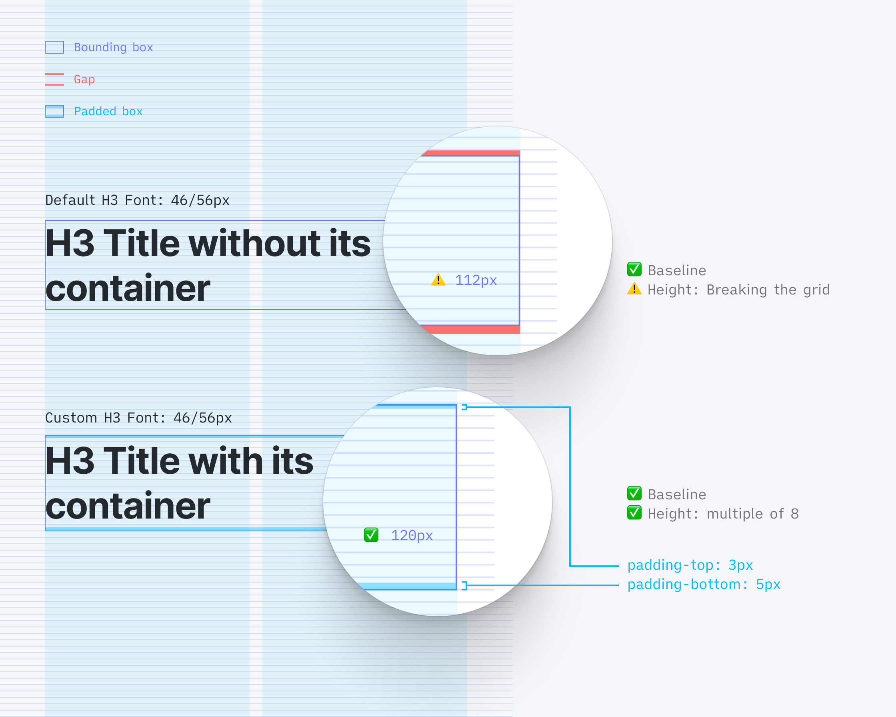
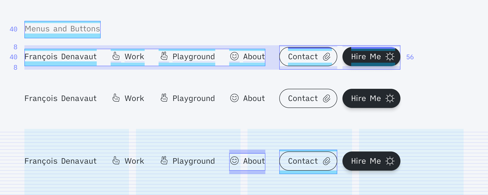
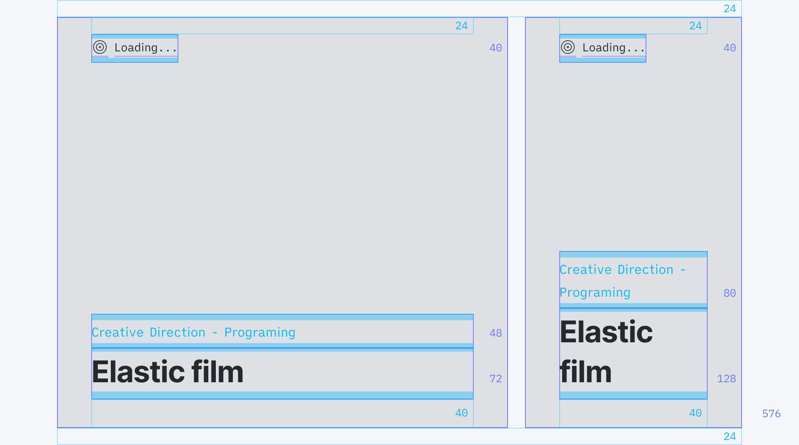
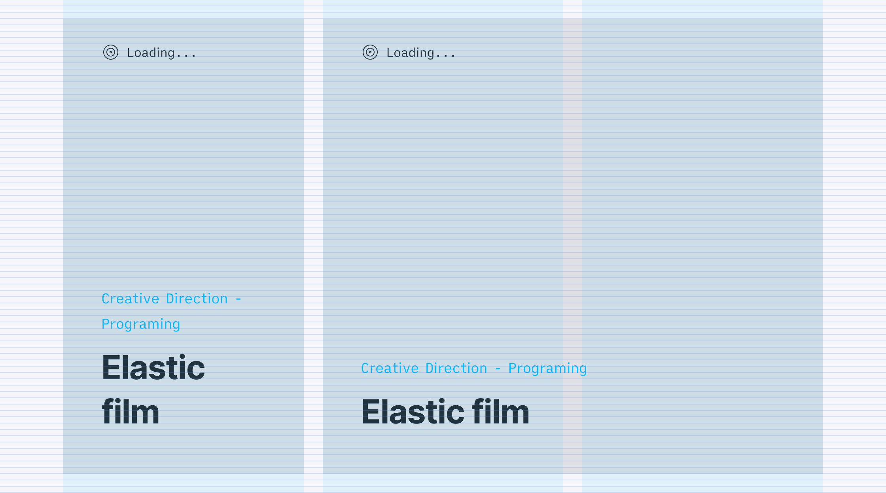

# Personal take on the 8px Grid systems – Or how to make the Hard grid method as easy to implement as the Soft grid method? <!-- omit in toc -->

## Why 8px grid? <!-- omit in toc -->

Why is it becoming a rule to build a website and design system based on an 8px grid system?

- Help to manage pixel-perfect better
- It scales perfectly in all the different screen displays (including android's @0.75 and @1.5).
- Grid rhythm
- Google and Apple say so (Seems to be a best practice already in place)
- Simple multiple, easily divisible, and scalable

---

Some articles about it the subject, if you need to get some freshen up reminder:

- [The Comprehensive 8pt Grid Guide ↗️](https://medium.com/swlh/the-comprehensive-8pt-grid-guide-aa16ff402179)
- [Text Baseline ↗️](https://alistapart.com/article/settingtypeontheweb/)
- [From Google DS ↗️](https://www.designsystems.com/space-grids-and-layouts/)
- [Hard vs. Soft Grid method ↗️](https://medium.com/sketch-app-sources/hard-and-soft-8-point-grids-60cf803b9de4)

### Hard grid method <!-- omit in toc -->

Everything snaps to a strict 8x8 pixel grid, and typography sits on a baseline.


### Soft grid method <!-- omit in toc -->

Everything still follows the 8 point scale, but we remove the vertical baseline and horizontal adherence to a strict 8x8 pixel grid. The spacing between every element can become a multiple of 8 (note that 4 and 12px, which are commonly included in the list of spacers, even though not /8)


With the soft grid method, we are not getting the mathematical grid rhythm from the Print world. Why would we be settling up for a soft grid system while there are evident and scalable tricks to develop? I think it's a shame, and I started to explore some work-around to make the Hard grid method implementation as simple as implementing the soft grid method.

### What's stopping us from having to implement a Hard grid <!-- omit in toc -->

- Seamingly uncontrollable and random Font baseline
- None divisible by 8 spacings in between elements
- Lack of control of every component
- Image heights
- Responsiveness

---

## What I'm experimenting with to simplify Hard grid implementation <!-- omit in toc -->

I'm going to cover how I'm designing build-around to handle these issues.

TLDR; I'm encapsulating each element to be their own 8px height elements (yes, fonts as well) - so there aren't any components dropped on the page that is not independently a multiple of 8.

- [Get your design grid into your coding environment](#get-your-design-grid-into-your-coding-environment)
- [Encapsulate font as components divisible by 8](#encapsulate-font-as-components-divisible-by-8)
- [Every other components must have a height divisible by 8](#every-other-components-must-have-a-height-divisible-by-8)
  - [Font and Icons](#font-and-icons)
  - [Menus](#menus)
  - [Links](#links)
  - [Button and Inputs](#button-and-inputs)
  - [Cards](#cards)
  - [Devices](#devices)
  - [Images](#images)
  - [Responsiveness](#responsiveness)
- [Opening up for discussion](#opening-up-for-discussion)

### Get your design grid into your coding environment

Code your own 8px grid to have a visual reference to build all your components
One of the many reasons for not implementing the Hard grid system is that there aren't grid systems available for frontEnd developers – whereas it is simple to get in Figma or Sketch. So I built a Hook to have a grid available for every new project.


```javascript
import { useDocumentSize } from "../../hooks/useDimensionSize"
import React, { useEffect, useState } from "react"

const Horizontal = (props) => {
  const document = useDocumentSize() // Hook to get the height of the page
  const [rowNumber, setRowNumber] = useState(0) // Initialize the number of rows for the grid
  const rowArray = [] // Initialize an array to contain all the row

  useEffect(() => {
    // Define the number of 8px height rows needed to fill the entire height of the page
    if (document.height) setRowNumber(Math.trunc(document.height / 8))
  }, [document.height])

  for (let index = 0; index < rowNumber; index++) {
    // Generate that many rows in your array
    rowArray.push(<div key={index} className={classes.Row}></div>)
  }

  // Return your grid container with all these rows!
  return <div className={classes.Horizontal}>{rowArray}</div>
}

const HorizontalStyle = createUseStyles({
  Horizontal: {
    zIndex: "-1", // No one wants the grid to interfere with the UI!
    position: "absolute",
    top: 0,
    left: 0,
    width: "100%",
    userSelect: "none",
  },

  Row: {
    position: "relative",
    top: 0,
    width: "100%",
    height: 8,

    "&:after": {
      content: '""',
      position: "absolute",
      bottom: 0,
      width: "100%",
      height: 1,
      background: #E1E4FF,
    },
  },
})

```

`TODO: Create a standalone Grid Hook`

### Encapsulate font as components divisible by 8

#### Font Line-height <!-- omit in toc -->

Need to make sure each selected font has a line-height based on a multiple of 8.

It's commonly assumed that a good line height should be around 130% of the font size. So I round up the result to its closest multiple of 8 to get the font to always sit on the baseline


```javascript
Math.ceil(x/8)*8
```

Or you can also use this [handy tool](https://www.thegoodlineheight.com) to calculate your baseline.

#### Font Line-box <!-- omit in toc -->

> The height of the line-box is calculated from the height of all its child elements. The browser will calculate the height of each child element in this line, and then get the height of the line-box (specifically, the height from the highest point to the lowest point of the child element), so by default, a line-box is always Have enough height to accommodate its child elements.

c.f. [Deep dive CSS: font metrics, line-height and vertical-align](https://iamvdo.me/en/blog/css-font-metrics-line-height-and-vertical-align)

The idea is to encapsulate each individual font into its own Container that's divisble by eight.
Then we adjust the paddings up and down as necessary to get the font to correctly sit on the baseline.



```javascript
// Gotta work on an understable fontWrapping concept
export const FontH3 = () => {
  <div>
    <FontSpacer height={3} />
    <h3>This is your text component</h3>
    <FontSpacer height={5} />
  </div>
}
```

Set it up once and for all, for each font used in your design system. Only call your Font container component and you'd always have a prestine font.

[Github FontWrapper component to simplify for the article ↗️](https://github.com/dnvt/Dnvt-Folio/blob/c21a4d484a703532a6f19ebb939e57dd11b7de04/src/utils/fonts/elements/FontTagWrapper.tsx#L8)

#### Result <!-- omit in toc -->

So just to make sure the benefits are clear, let's look at the initial example, with our custom 8px based height font containers. Displayed below, same design view a) without the grid system,b) with the baseline grid and finally b) with the padding grid.


See what's hapenning here?
All spacers are now multiple of 8, all font containers are multiple of 8, but everything sits perfectly on the baseline by default.

The implementation start to already feel as simple as with the soft grid method.


#### Caveat <!-- omit in toc -->

One of the drawback with this method is that you can't anymore just `T` key in Figma (or whatever other software you are using) and start typing your text, then pick from one of your font style.
Rather, you have to get used to pick your font container from the list of Components.  ¯/\_(ツ)_/¯


### Every other components must have a height divisible by 8

Well, this is lovely you gonna say, but it's only dealing with font elements! How about all these other cases with buttons, icons. Whatabout my cards elements and the dividers and all this??!
These are great questions and worries! Though if the font is set up as an independent and / 8 element, 90% of the work is already done, really!

Reminder: You only want to use 8px grid Spacers to manage spacings and rhythm in between components otherwise, would break all your component alignment efforts.


#### Font and Icons

Assuming that you are using icons of 16px, 24px or 32px, let's see how you everything fits with an icon.

#### Menus 

As an example, I'm going to use my Menu and my Link components.
For both components, I'm using existing font Legend and existing font Body. Because I'm using a custom underline on hover, I'm not reusing the default Font Container in so I can adjust the underline position within the container.


So now, however you place and combine your menus component together, you know with certainty that they will always be conveniently snapping on that 8x8 grid, with the font on its baseline.

For example, menus combined in a header:


#### Links

Similarly for the links components that use the a similar font than the body font, in order to fit the underline properly on the basline, I had to customize the font. So I have both Font Body at 23/32px and the font links at 23/24px.
This way, I have some space in the component to play with the spacing between the font and the underline, to make it snap perfectly.


And thus, here how easy and perfectly snapped is a footer using these links.


#### Button and Inputs

Something strange happened when I worked on the buttons. Unlike what I'm used to, I couldnt find a way to have both the button to be perfectly on the 8px grid, nor have the font aligned on the baseline. But after some get used to, now it feels like a necessary even – that actually doesn't fall off of our previous guidelines.

Might feel un natural but the same logic used for the font is applied for the buttons.
Keep the font content on the baseline, build your button shape, vertically centered as pleased around it. Then and only then can you box the whole thing in it's container, with paddings up and down to sit the button on its grid.

##### Inputs <!-- omit in toc -->


Another version of the inputs that could be considered more tricky?
Indeed in this case, I'm using margin negative... but 16px, multiple of 8 as well!


**Note on the borders:**
Wether or not the borders are inside or outside type of outline, it doesn't impact the size of your container. It's like a virtual invisible coat of paint on a shape. It's not going to be affecting your spacing.

If you have some issues managing borders in css, have a look at box-sizing: border-box method [on CSS Tricks](https://css-tricks.com/box-sizing/) and play around with *border* and/or *outline* css property!

##### Buttons <!-- omit in toc -->

Similarly with the buttons, the outline of the buttons can't snap on the grid if we want the font to seat on the baseline, but the Button containers needs some padding tweeks to fit our rule.


An example of menus and buttons living together. Everything vertically align perfectly! Everything is on an irreprochable baseline.

We did it! ✅



##### Forms <!-- omit in toc -->

So to wrape up this section with complex inputs and button's height – here there are, all together in a form. Just stack on top of each other, with spacers in between.


Same for less complicated components

#### Cards






#### Devices

#### Images

- Imposing a height divisible by 8 for any images
- We kinda force this for images width; I don't see any problem with masking images' height
- Working on automating it (TODO: Work on a script with modulo to force the height to be / 8)

#### Responsiveness

- Grid systems
- Mobile grid and all

### Opening up for discussion
