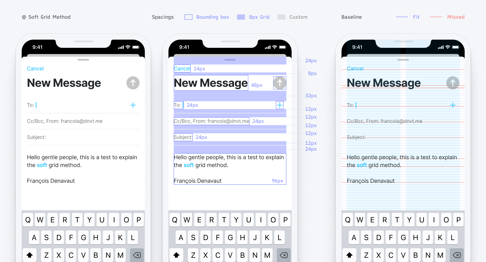
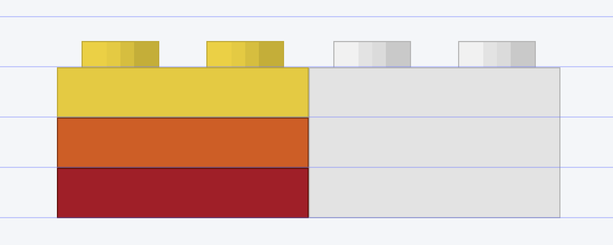
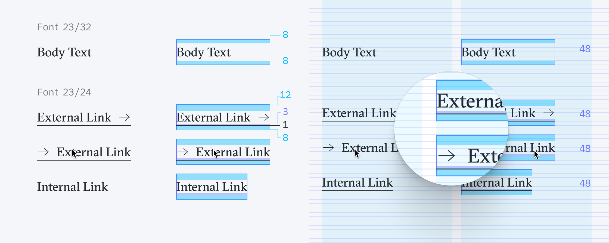
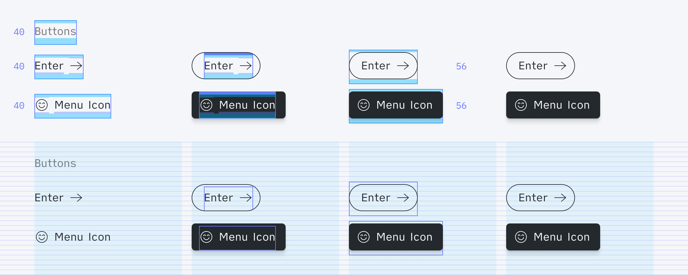
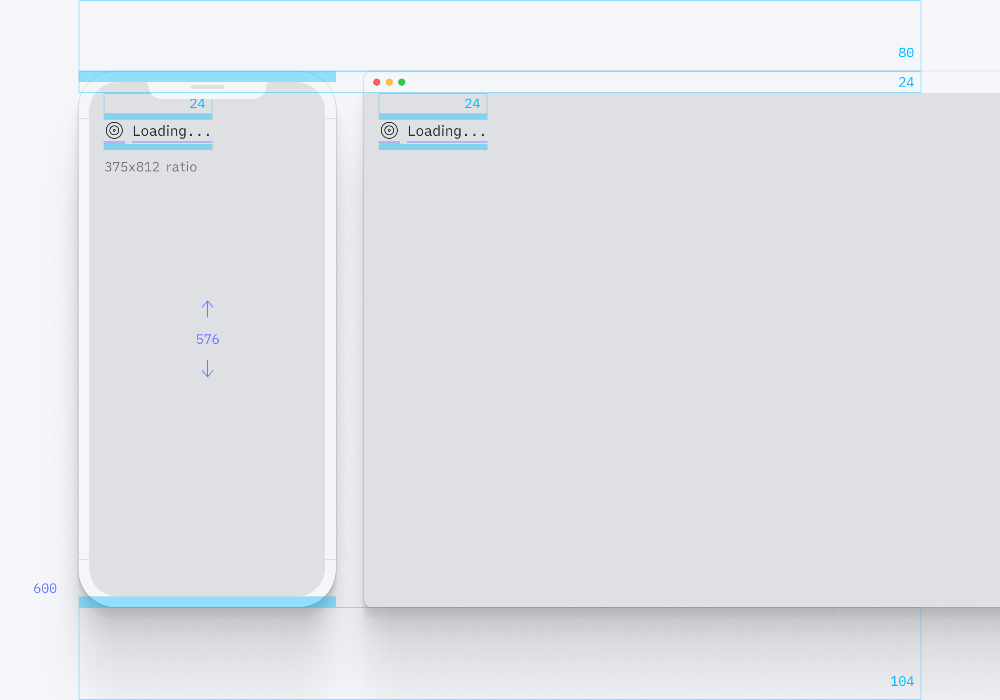
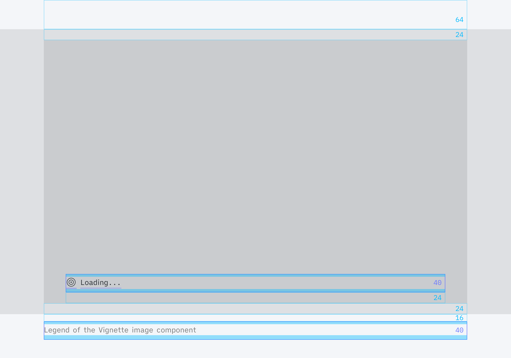
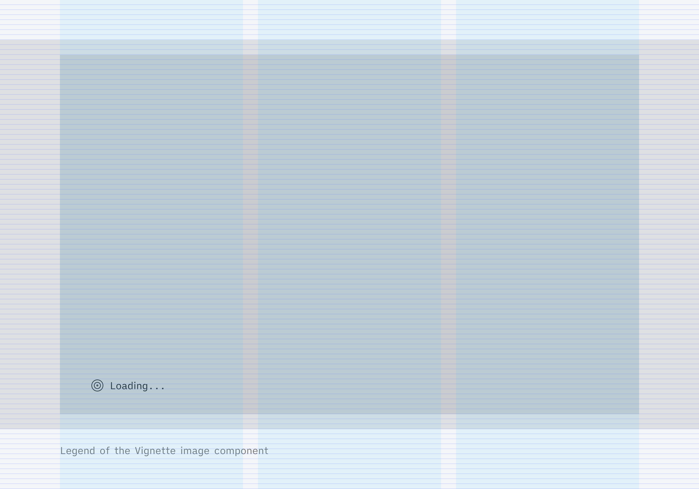

# Personal take on the 8px Grid systems – Or how to make the Hard grid method as easy to implement as the Soft grid method?

## The 8px grid system

### Refresher

Many people and blogs are talking about either designing with an 8px grid system or forgetting grids altogether. I personally think grids and baselines are beautiful mathematical systems that, used properly, are more than just helpers or guides. They can elevate your designs. One of these fantastic foundations coming from the print design world that seems to never be appropriately implemented in the digital space because of scale or coding complexity.

Some of the reasons why people tend to use the 8px grid system:

- It helps to manage pixel-perfect better
- It scales perfectly in all the different screen displays (including android's @0.75 and @1.5)
- Google and Apple say so (Seems to be a best practice already in place)
- Simple multiple, easily divisible, and scalable
- Probably plenty of arguments more that I'm forgetting

Some articles about the subject, if you need to get some literature on the subject:

- [The Comprehensive 8pt Grid Guide ↗️](https://medium.com/swlh/the-comprehensive-8pt-grid-guide-aa16ff402179)
- [Text Baseline ↗️](https://alistapart.com/article/settingtypeontheweb/)
- [From Google DS ↗️](https://www.designsystems.com/space-grids-and-layouts/)
- [Hard vs. Soft Grid method ↗️](https://medium.com/sketch-app-sources/hard-and-soft-8-point-grids-60cf803b9de4)

Using some of the jargon from these articles, here are the two common ways to implement the 8px grid system.

### Hard grid method

Icons and other components' sizes are multiples of 8, so they snap to a strict 8x8 pixel grid, **and the typography always sits on a baseline (as it should).**

> Baseline grid. In typography, the baseline is a line upon which the text rests. Aligning baselines to a specific absolute grid establishes a vertical rhythm, which is easier for the human brain to scan, especially with multiple-column content.


### Soft grid method <!-- omit in toc -->

Everything still follows the 8 point scale, **but we remove the vertical baseline and horizontal adherence to a strict 8x8 pixel grid.** The spacing between every element can become a multiple of 8. Note that 4 and 12px, which are commonly included in the list of spacers, even though not multiple of 8.

This is seemingly easier to implement because one doesn't have to do a case-per-case spacing assessment with the developers. 



### Personal take

With the soft grid method, we are not getting the mathematical grid rhythm at all. It feels like a simplified version of a grid system, purely vertical, to ease the implementation. 

Why would we settle up for a soft grid system while we could develop evident and scalable tricks? 
I think it's a shame not to, and I started to explore some work-around to make the Hard grid method implementation as simple as implementing the soft grid method.

So in this article, I'm going to detail these methods I used and some of the design system components I created to build my portfolio, answering this question of how one can implement a perfect 8x8 Hard grid method with the ease of the soft grid method.

---

## The building of an 8x8 design system

To make an analogy, let's consider the bricks that are used to build walls. Every brick shares the same height; otherwise, it would break the horizontal pattern of a wall, building a house very tedious. (You would have to compensate for every size variation of the bricks)


Photo by <a href="https://unsplash.com/@mitchel3uo?utm_source=unsplash&utm_medium=referral&utm_content=creditCopyText">Mitchell Luo</a> on <a href="https://unsplash.com/wallpapers/design/brick?utm_source=unsplash&utm_medium=referral&utm_content=creditCopyText">Unsplash</a>

That's it. That's the concept. Consider each element (or component to take a more design system term) that you put on a page like a brick. Each of these components has to fit the 8-pixel rule to be accepted – otherwise, your entire vertical grid pattern would be broken, and you would have to compensate for each variation at a time.

To make it less figurative, I'm encapsulating each element to be a component with a height equal to a multiple of 8 (yes, fonts as well). 
That way their bounding box is always siting on the baseline.


Each of these components should be independently dealing, inside their own container, with top and bottom paddings to fit the baseline, to offset the typography. 


So no matter where you call the components, they match the grid system of 8px with a de-facto typography that sits on the baseline. No more spacing compensation on the case-per-case, for every new page you create. The offsets are dealt with, within your components.

Does this make sense?
To illustrate and prove that this is doable, these are the steps we are going to explore together, based on my portfolio design system:

1. [Get your grid into your coding environment](#get-your-design-grid-into-your-coding-environment)
2. [Encapsulate fonts in components divisible by 8](#encapsulate-font-as-components-divisible-by-8)
3. [Every other component must have a height divisible by 8](#every-other-components-must-have-a-height-divisible-by-8)

### 1. Get your design grid into your coding environment

If you want to implement your design system based on a grid system, there is no other way to bring your grid and baseline guides to your local coding environment.

One of the many reasons for not implementing the Hard grid system is that there aren't grid systems available on the browser for developers – whereas it is simple to get in Figma or Sketch. 

So I recommend you code your own grid and have a visual reference to implement all your components.


Here is the Grid component that I built for my project.

```javascript
import { useDocumentSize } from "../../hooks/useDimensionSize"
import React, { useEffect, useState } from "react"

const Horizontal = (props) => {
  const document = useDocumentSize() // Hook to get the height of the page
  const [rowNumber, setRowNumber] = useState(0) // Initialize the number of rows for the grid
  const rowArray = [] // Initialize an array to contain all the row

  useEffect(() => {
    // Define the number of 8px height rows needed to fill the entire height of the page
    if (document.height) setRowNumber(Math.trunc(document.height / 8))
  }, [document.height])

  for (let index = 0; index < rowNumber; index++) {
    // Generate that many rows in your array
    rowArray.push(<div key={index} className={classes.Row}></div>)
  }

  // Return your grid container with all these rows!
  return <div className={classes.Horizontal}>{rowArray}</div>
}

const HorizontalStyle = createUseStyles({
  Horizontal: {
    zIndex: "-1", // No one wants the grid to interfere with the UI!
    position: "absolute",
    top: 0,
    left: 0,
    width: "100%",
    userSelect: "none",
  },

  Row: {
    position: "relative",
    top: 0,
    width: "100%",
    height: 8,

    "&:after": {
      content: '""',
      position: "absolute",
      bottom: 0,
      width: "100%",
      height: 1,
      background: #E1E4FF,
    },
  },
})

```

And I have a hook to toggle the grid visibility.

`TODO: Create a standalone Grid Hook`

### 2. Encapsulate font as components divisible by 8

Now that we have our grid, we can build our components and check their baseline and bounding-box directly in the browser.

Since the font is arguably the most essential part of our designs, we will explore this first. Most of the other components fall off from your Font management anyways.

#### Line-height 

First, we need to ensure each font in the design system has a line height based on a multiple of 8.


It's commonly assumed that a good line height should be around 130% of the font size. Round up the result to its closest multiple of 8 to get the font to always sit on the baseline.

```javascript
Math.ceil(x/8)*8
```

Or you can also use this [handy tool](https://www.thegoodlineheight.com) to calculate your baseline.

#### Line-box / bounding-box

The line-box or bounding-box of a font or component is the physical limit within which your element is contained.


The idea is to encapsulate each individual font into its own container divisible by 8 while adjusting the top and bottom of the padding as necessary to get the font to correctly sit on the baseline.


```javascript
// Gotta work on an understable fontWrapping concept
export const FontH3 = () => {
  return (
    <div>
      <FontSpacer height={3} />
      <h3>This is your text component</h3>
      <FontSpacer height={5} />
    </div>
  )
}
```

Set it up once and for all for each font used in your design system. Only call these font components in your design, and you'll not have to compensate spacings for having your font sitting on the baseline.

[Github FontWrapper component to simplify for the article ↗️](https://github.com/dnvt/Dnvt-Folio/blob/c21a4d484a703532a6f19ebb939e57dd11b7de04/src/utils/fonts/elements/FontTagWrapper.tsx#L8)

Some more in-depth details about bounding-box compensation can be read [here](https://uxdesign.cc/baseline-grids-design-systems-ae23b5af8cec).

It's using a precise 5 steps method:
1. Absolute Grid Setup;
2. Height Rule;
3. Line Height Rule;
4. Offsetting Typography;
5. Compensating Typography's Offset.

#### Result 

Let's look at the initial example with our custom 8px based height font containers to ensure the benefits are clear. Displayed below, same design view a) without the grid system, b) with the baseline grid, and finally, c) with the padding grid.


See what's happening here?
All spacers are multiple of 8, all font containers are now multiple of 8, and everything sits perfectly and automatically on the baseline.

The implementation starts to already feel as simple as with the soft grid method.


#### Caveat

One of the drawbacks with this method is that you can't anymore just hit the `T` key in Figma (or whatever other software you are using) and start typing some text. Instead, you have to get used to picking your font container from the list of Components.  ¯/\_(ツ)_/¯


### 3. Every other components must have a height divisible by 8

Well, this is lovely you gonna say, but it's only dealing with font elements! How about all these other cases with buttons, icons. Whatabout my cards elements and the dividers and all this??!
These are great questions and worries! Though if the font is set up as an independent and / 8 element, 90% of the work is already done, really!

Reminder: You only want to use 8px grid Spacers to manage spacings and rhythm in between components otherwise, would break all your component alignment efforts.


#### Font and Icons

Assuming that you are using icons of 16px, 24px or 32px, let's see how you everything fits with an icon.

#### Menus 

As an example, I'm going to use my Menu and my Link components.
For both components, I'm using existing font Legend and existing font Body. Because I'm using a custom underline on hover, I'm not reusing the default Font Container in so I can adjust the underline position within the container.


So now, however you place and combine your menus component together, you know with certainty that they will always be conveniently snapping on that 8x8 grid, with the font on its baseline.

For example, menus combined in a header:


#### Links

Similarly for the links components that use the a similar font than the body font, in order to fit the underline properly on the basline, I had to customize the font. So I have both Font Body at 23/32px and the font links at 23/24px.
This way, I have some space in the component to play with the spacing between the font and the underline, to make it snap perfectly.



And thus, here how easy and perfectly snapped is a footer using these links.


#### Button and Inputs

Something strange happened when I worked on the buttons. Unlike what I'm used to, I couldnt find a way to have both the button to be perfectly on the 8px grid, nor have the font aligned on the baseline. But after some get used to, now it feels like a necessary even – that actually doesn't fall off of our previous guidelines.

Might feel un natural but the same logic used for the font is applied for the buttons.
Keep the font content on the baseline, build your button shape, vertically centered as pleased around it. Then and only then can you box the whole thing in it's container, with paddings up and down to sit the button on its grid.

##### Inputs <!-- omit in toc -->


Another version of the inputs that could be considered more tricky?
Indeed in this case, I'm using margin negative... but 16px, multiple of 8 as well!


**Note on the borders:**
Wether or not the borders are inside or outside type of outline, it doesn't impact the size of your container. It's like a virtual invisible coat of paint on a shape. It's not going to be affecting your spacing.

If you have some issues managing borders in css, have a look at box-sizing: border-box method [on CSS Tricks](https://css-tricks.com/box-sizing/) and play around with *border* and/or *outline* css property!

##### Buttons <!-- omit in toc -->

Similarly with the buttons, the outline of the buttons can't snap on the grid if we want the font to seat on the baseline, but the Button containers needs some padding tweeks to fit our rule.



An example of menus and buttons living together. Everything vertically align perfectly! Everything is on an irreprochable baseline.

We did it! ✅


##### Forms <!-- omit in toc -->

So to wrape up this section with complex inputs and button's height – here there are, all together in a form. Just stack on top of each other, with spacers in between.


Same for less complicated components

#### Cards

I'm using cards as a visual entry point to my work projects. It's a combination of image with couple of text.
The cards are force into a 8x8 height and the text are placed with spacer, within card, fitting the baseline as always, effortlessly.


#### Devices

I css some device components to present some of my work. 
Only little issue here (apart from making the iphone looks like one with CSS) was to keep the iphone screen ratio correct at all time, without breaking the 8x8 height rule.

For the browser, well, it a bit messier. I just have the 8x8 height, my image to fit in on its lenght – and I have the with truncated however it fits.  ¯\_(ツ)_/¯ 




#### Images

Same with all the images. Make sure to be imposing a height divisible by 8 for any images' container. 






And if you can't get to think about your images with a fixed height, maybe let them go wild but make sure the height is only scaling gradually by 8.

To reuse previous code:

<!-- Try the code! And make a GIF demo -->

```javascript
import React, { useRef, useEffect, useState } from 'react'

const Vignette = () => {
  const imageHeight = useState()
  const ref = useRef()

  useEffect(() => {
    if (ref && ref.current && ref.current.clientHeight) {
      imageHeight = ref.current.clientHeight
    }
  }, [])
  
  return (
    <div 
      style={{
        overflow:"hidden", 
        height: imageHeight ? Math.ceil(imageHeight/8)*8 : 480
      }}>
      
      
    </div>
  )
}
```

#### Responsiveness

Nothing really changes because of mobile version. 
The same grid is applied and the same 8x8 and height rule applies. If your components and the fonts have to be smaller, than be it. Redesign them to match you use case. 
That's what I did with most of my components.
- Grid systems
- Mobile grid and all

### Opening up for discussion

So, not sure if I have a conclusion, but I liked very much working all my components in Figma and React this ways. The initial creation and implemation of each component is a bit tedious but, so does creating a Design System from scratch!

You can see all the components that I presented in the article on [Figma](https://www.figma.com/file/rmvFgJXvCa8bjYaj2iU4PI/8px-Grid?node-id=724%3A961).

And you can also see all the components that I made in react on my website at [dnvt.me/guidelines](www.dnvt.me/guidelines). (Website fully using this 8x8 design system)
<!-- TODO: Add the link for dnvt.me/guidelines when live  -->

Let me know if you have any questions, any suggestions or improvment to offer to build on this idea/concept. Lemme know if you find this totally absurd and the whys, it would also tremendously help the grid discussion.

Thanks for reading! 

✌🏽