# The Padded Grid: A Designer’s Hack To Achieve Baseline Fit.

There is still a lot of controversy about implementing a grid system when designing for digital layouts. I personally think grids and baselines are beautiful mathematical systems that, used properly, are more than just helpers or guides. They can elevate your designs. 

Horizontal and Responsive grid systems are extensively explored within CSS frameworks. However, baseline grids are one of these fantastic foundations inherited from the print world that seems seldom implemented in the digital space.

This inspired me to take on the challenge to build my own grid system – which I'll be calling the Padded Grid for the sake of this article.

## Personal Take

### Refresher on the grid systems

#### Baseline Grid

A baseline grid is a series of invisible vertical units that assist in creating consistent vertical spacing with your typography and page elements. It's a hidden way of giving order to disorder. In short, baseline grids:

- Takes the guesswork out of how to space elements vertically
- Allows elements across columns to line up visually
- Provides guidelines for teams working on a project
- Helps to unify scale
- Brings cohesion and consistency to designs


Some visuals to illustrate baselines, from [Ellen Lupton's website](http://thinkingwithtype.com/grid/)

#### 8px Grid method

This method uses multiples of 8 to define your design elements' dimensions, padding, and margin. Designers tend to prefer this 8px scale over other scales (5px, 6px, 10px) for a couple of reasons:

- Eliminates guesswork and decision fatigue while designing and developing
- Simple multiple, easily divisible, and scalable
- Helps better manage pixel-perfect
- Scales perfectly in all the different screen displays (including android's @0.75 and @1.5)
- Google and Apple seem to define it as best practice

Based on my research, there are two different variations on implementing this 8px Grid method: the Hard way and the Soft way. (I stole the wording from other articles)

**Note:** Because 8px is quite a big start of a scale value for your designs, 4px and 12px are commonly included in the list of spacers for some visual edge cases, even though they are not multiples of 8.

#### Hard Grid method

This method is a combination of the 8x Grid method with the Baseline Grid. 

Icons, font-size, and other components' sizes are multiples of 8, so they snap to a strict 8px Grid. However, the space between elements is not. Users have to adjust the margins for **the typography to sit on the baseline (as it should).** 

The biggest drawback with the Hard Grid method is settings the spaces on a case-per-case. Which makes it tedious and a less appreciated candidate for implementation.


[Check in Figma ->](https://www.figma.com/file/rmvFgJXvCa8bjYaj2iU4PI/8px-Grid?node-id=844%3A21169)

#### Soft Grid method

Closer to the definition of the 8px Grid Method, one follows the multiple of 8 rule, **but one removes the vertical baseline and horizontal adherence to a strict 8px Grid.** The spacing between every element can be a multiple of 8. 

The Soft Grid method is seemingly easier to implement because one doesn't have to do a case-per-case spacing assessment with the developers. 


[Check in Figma ->](https://www.figma.com/file/rmvFgJXvCa8bjYaj2iU4PI/8px-Grid?node-id=847%3A20071)

#### Frustrations

With the Soft Grid method, we truly are not getting the mathematical grid rhythm at all. It feels like a simplified version of a grid system, purely vertical, to ease the implementation. 

Why would we settle up for a Soft Grid system while we could develop obvious and scalable tricks? 
I think it's a shame not to, and that's why I started to explore some workaround that makes the Hard Grid method implementation as simple as the Soft Grid method one.

So in this article, I'm going to detail these methods I used through some of the design system components I crafted for my portfolio, answering this question of how one can implement a perfect 8x8 Hard Grid method with the ease of the Soft Grid method.

### Padded Grid

To introduce the central concept used here, let me make an analogy. Consider the Lego bricks; every brick's height and width share a multiple – meaning that you can stack x amount of bricks to match the size of a larger brick. Without this rule, it would be nearly impossible to stack a variety of bricks horizontally to build a wall. You would have to compensate for every size variation, maybe even with pieces not part of the lego set!


That's it. That's the concept. 

Consider each component you put on a page to be a lego brick. Each one has to fit the 8x8 scale rule to be accepted – otherwise, your entire grid pattern would break, and you would have to compensate for each variation at a time to make up for it. (That's the painful part of implementing the Hard Grid method.)

To make it less figurative, I'm encapsulating each element as a component with a height equal to a multiple of 8 (yes - especially the fonts). That way, their bounding box is always sitting on the baseline.


**But, the most essential piece of the concept is that each of these components independently deals with their top and bottom paddings to offset the typography and make sure the typography sits on the baseline.**

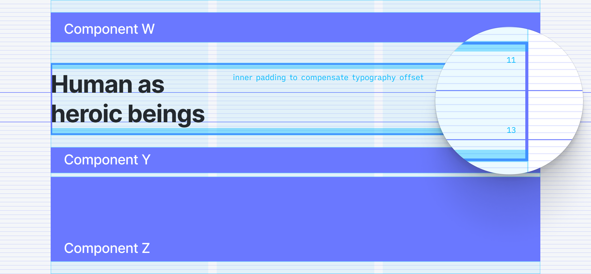

[Check in Figma ->](https://www.figma.com/file/rmvFgJXvCa8bjYaj2iU4PI/8px-Grid?node-id=850%3A20629)

Consequently, no matter where you call the components, they match the 8x8 scale grid system with typography that de-facto sits on the baseline. No more spacing compensation on the case-per-case for every new page you create.

Does this make sense yet?

To illustrate and prove that this is doable, we are going to explore the following steps together:

1. [Get your grid into your developer environment](#get-your-design-grid-into-your-developer-environment)
2. [Encapsulate fonts in components that are divisible by 8, and offset the typography](#encapsulate-fonts-in-components-that-are-divisible-by-8,-and-offset-the-typography)
3. [Same shit, different components](#same-shit,-different-components)

## How to implement the Padded Grid System

### 1. Get your design grid into your developer environment

If you want to code your designs based on a grid system, there is only one way; you need to bring your grid and baseline guides to your developer environment.

**In my opinion, one of the many reasons for not implementing the Hard Grid system is that there aren't grid systems available on the browser for developers – whereas it is simple to set them on Figma or Sketch.** 

So I recommend you code your own Grid and have a visual reference to implement all your components.

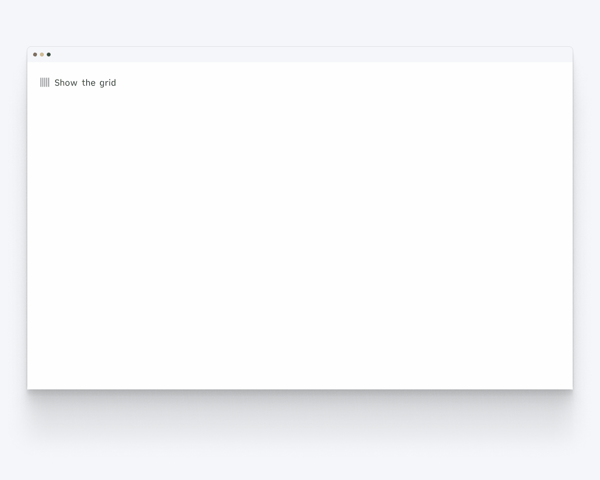

Here is the Horizontal Grid component that I built for my project.

[Link to the Codesandbox demo ->](https://codesandbox.io/s/grid-toggle-82vq1)

### 2. Encapsulate fonts in components that are divisible by 8, and offset the typography

Now that we have our Grid, we can build our components, check their baseline and bounding-box directly in the browser.

Since the typography is arguably the most essential part of our designs, we will explore this first. Most of the other components fall off from your Font management anyways.

#### Line-height 

First, we need to ensure each font in the design system has a line height based on a multiple of 8. This will ensure that your font leading respects the 8x8 scale and that your typography sits on the baseline.

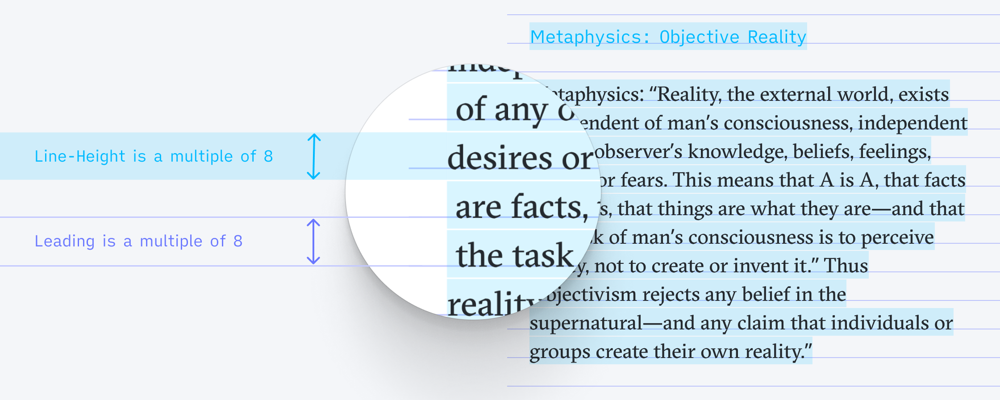

[Check in Figma ->](https://www.figma.com/file/rmvFgJXvCa8bjYaj2iU4PI/Padded-Grid?node-id=859%3A20480)

It's commonly assumed that a good line height should be around 130% of the font size. Round up the result to its closest multiple of 8 to get the font to always sit on the baseline.

```javascript
Math.ceil(x/8)*8
```

Or you can also use this handy tool, [the good line height](https://www.thegoodlineheight.com), to calculate your baseline.

#### Line-box or bounding-box

The bounding box of a font (or other components) is the container size of an element, as calculated by the browser (or software).

The idea is to encapsulate each individual font (whose height is divisible by 8) while adjusting the top and bottom paddings of the container to get the typography correctly seated on the baseline. 

1. The padding-top offsets the typography to make it sit on the baseline. 
2. The padding bottom compensates for the typography's offset, so the bounding box fits the 8x8 scale system.


[Check in Figma ->](https://www.figma.com/file/rmvFgJXvCa8bjYaj2iU4PI/Padded-Grid?node-id=860%3A20554)

```javascript
export const FontH3 = () => {
  return (
    <div>
      <FontPadding height={3} />
      <h3>This is your text component</h3>
      <FontPadding height={5} />
    </div>
  )
}
```

[Link to the Codesandbox demo ->](https://codesandbox.io/s/padded-font-mf9qd)

#### Result 

Let's look at the initial example with our custom 8px based height font containers to ensure the benefits are clear. Displayed below, same design view a) without the grid system, b) with the baseline grid, and finally, c) with the bounding box displayed.


[Check in Figma ->](https://www.figma.com/file/rmvFgJXvCa8bjYaj2iU4PI/Padded-Grid?node-id=861%3A20589)

See what's happening here?
All spacers are multiple of 8, all font containers are now multiple of 8, and everything sits perfectly and automatically on the baseline.

The implementation starts to already feel as simple as with the Soft Grid method.

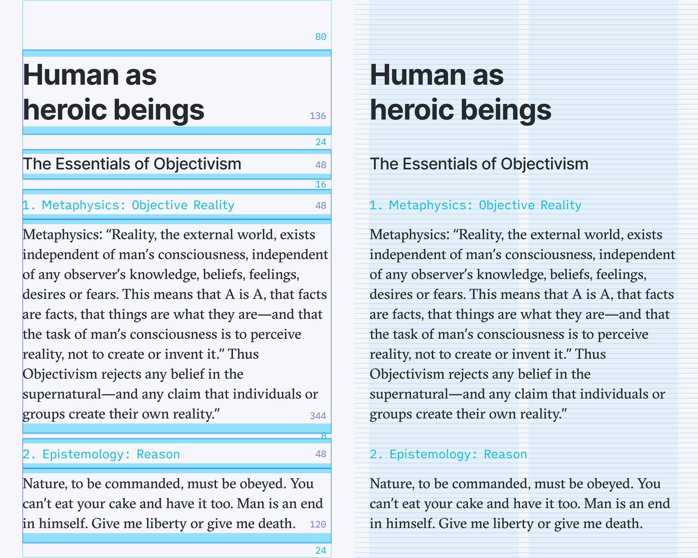

[Check in Figma ->](https://www.figma.com/file/rmvFgJXvCa8bjYaj2iU4PI/Padded-Grid?node-id=862%3A23053)

#### Caveat

One of the drawbacks with this method is that you can't anymore just hit the `T` key in Figma (or whatever other software you are using) and start typing some text. Instead, you have to get used to picking your font container from the list of Components. ¯/\_(ツ)_/¯


### 3. Same shit, different components

Well, this is lovely, but it's only about typography. How about all these other cases with icons and buttons. What about cards components, images, dividers, and all the rest?!

These are great questions! However, if your fonts are correctly set up, 90% of the work is already done, really! Let's have a look.

**Reminder:** You only want to use multiple of 8 Spacers to manage spacings and rhythm between components; otherwise, it would break all your component alignment efforts (no 4px or 12px in this instance!). 

In the following visuals, I'm changing a little bit the design of a spacer, for clarity.


[Check in Figma ->](https://www.figma.com/file/rmvFgJXvCa8bjYaj2iU4PI/Padded-Grid?node-id=866%3A21443)

#### Font and Icons

Assuming that you are using icons of 8x8 pixel scale such as 16x16px, 24x24px, or 32x32px icons, let's see how everything fits our model.

**Menus**

As an example, I will use the Menu and the Link components from my design system.
For both components, I'm using existing font Legend and font Body, with minimal variations.

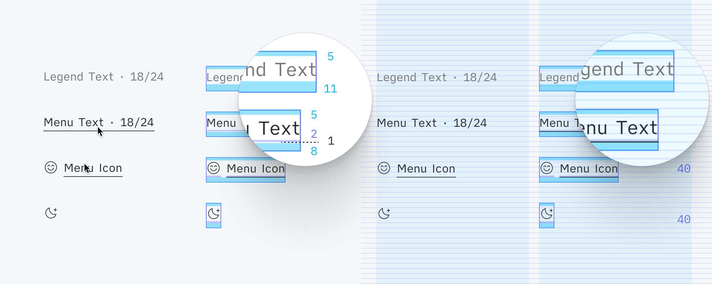

[Check in Figma ->](https://www.figma.com/file/rmvFgJXvCa8bjYaj2iU4PI/Padded-Grid?node-id=865%3A21330)

Because of an underline that appears on hover, I can't fully reuse the default initial Font components. I want the underline to be seating on the baseline that follows the typography. Hence I create a specific spacer in between the typography and the underline. Which alienates a little bit the final padding-bottom that compensates for the typography offset.

Because the icons will always be part of the Menu component variations, they are set in the same container. The (darker blue) spacer within the container helps for horizontally centering the icon.

So now, when I place and combine my Menu components together, I know with certainty that they will always be conveniently snapping on that 8x8 Grid, with the typography on its baseline.

For example, menus combined in a header:

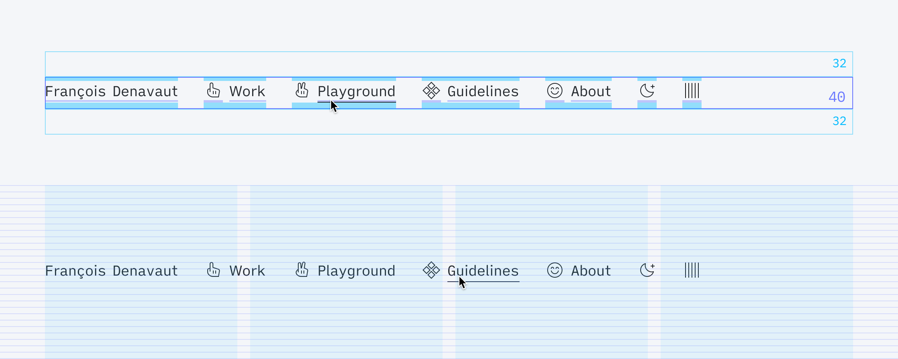

[Check in Figma ->](https://www.figma.com/file/rmvFgJXvCa8bjYaj2iU4PI/Padded-Grid?node-id=867%3A21588)

**Links**

Similarly, for the Link components that use the Body font, I had to impose padding-bottom variations, but in addition, to fit the underline properly on the baseline, I had to edit the font line-height. So at the end of the day, there are two fonts: Font Body at 23/32px and Font Link is at 23/24px.

Thereafter, I have enough space in the component to play with the distance between the typography and the underline and make it snap perfectly.


[Check in Figma ->](https://www.figma.com/file/rmvFgJXvCa8bjYaj2iU4PI/Padded-Grid?node-id=868%3A22748)

Here is a footer using these links – perfectly snapped to the Grid and super simple to implement.

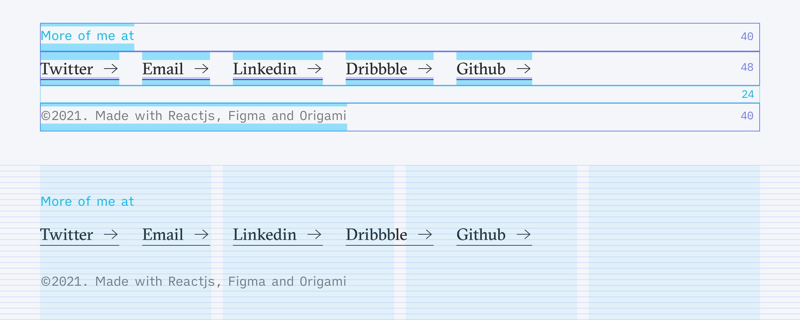

[Check in Figma ->](https://www.figma.com/file/rmvFgJXvCa8bjYaj2iU4PI/Padded-Grid?node-id=868%3A23127)

#### Inputs and Buttons

**Inputs**

The same logic used for the font is applied for the buttons and inputs.
It might feel a bit uneasy at first because the shape of the components does not necessarily fit the Grid.

Nonetheless, keep the focus on the typography and the baseline. Build your button/input shape, so the font appears horizontally centered in it. 

Then and only then can you encapsulate the whole thing in a container, with offsetting padding tops and bottoms that snap the complete Button component on the 8x8 Grid.

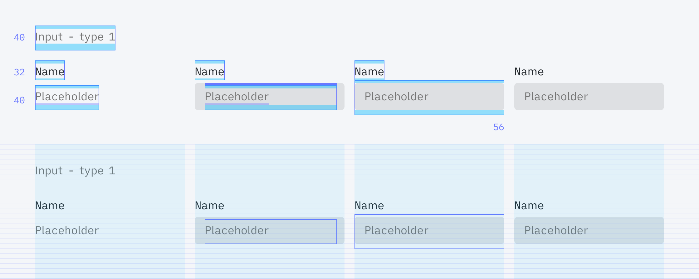

[Check in Figma ->](https://www.figma.com/file/rmvFgJXvCa8bjYaj2iU4PI/Padded-Grid?node-id=871%3A23039)

The below example is another version of inputs that could be considered unethical. Indeed, in this case, I'm using margin negative... but 16px, multiple of 8 as well!

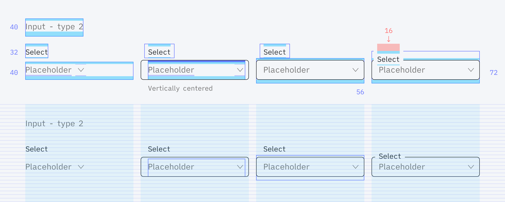

[Check in Figma ->](https://www.figma.com/file/rmvFgJXvCa8bjYaj2iU4PI/Padded-Grid?node-id=871%3A23348)

<!-- **Note on the borders:**
Whether or not the borders are inside or outside doesn't impact the size of its container. It's like a virtually invisible coat of paint on a shape. Hence, it's not affecting your spacing.

If you have issues managing borders in CSS, look at box-sizing: border-box method [on CSS Tricks](https://css-tricks.com/box-sizing/) and play around with *border* and/or *outline* CSS property!

**Note on the separators:**
Hold on to your horses! We will discuss this in 3 sections! -->

**Buttons**

Similarly, with the buttons, the outline of the buttons can't snap on the Grid if we want the font to sit on the baseline, but the Button containers need some padding tweaks to fit our rule.


[Check in Figma ->](https://www.figma.com/file/rmvFgJXvCa8bjYaj2iU4PI/Padded-Grid?node-id=871%3A23714)

An example of menus and buttons living together. Everything vertically aligns perfectly! Everything is on an irreproachable baseline.

We did it! ✅


[Check in Figma ->](https://www.figma.com/file/rmvFgJXvCa8bjYaj2iU4PI/Padded-Grid?node-id=871%3A24237)

**Forms**

So to wrap up this section with complex inputs and button heights – here they are, all together in a form. Just stack on top of each other, with spacers in between.


[Check in Figma ->](https://www.figma.com/file/rmvFgJXvCa8bjYaj2iU4PI/Padded-Grid?node-id=871%3A24682)

#### Separator

To discuss the separator, let me add one in our previous form.

Separators, in this case, are no borders. I'm not attaching them to a component, so you can't abstract their height. Their height matters. Meaning that a 1px height separator in our form design will impact and push your designs by 1px.

So what I like to do with my separators is to also contain them into their own 8px container to abstract their mathematical impact. Surprise!

This way, separators can be called anywhere in the designs without the fear of doing annoying math or doing some annoying CSS transform on your component to compensate for that seldom 1px height.

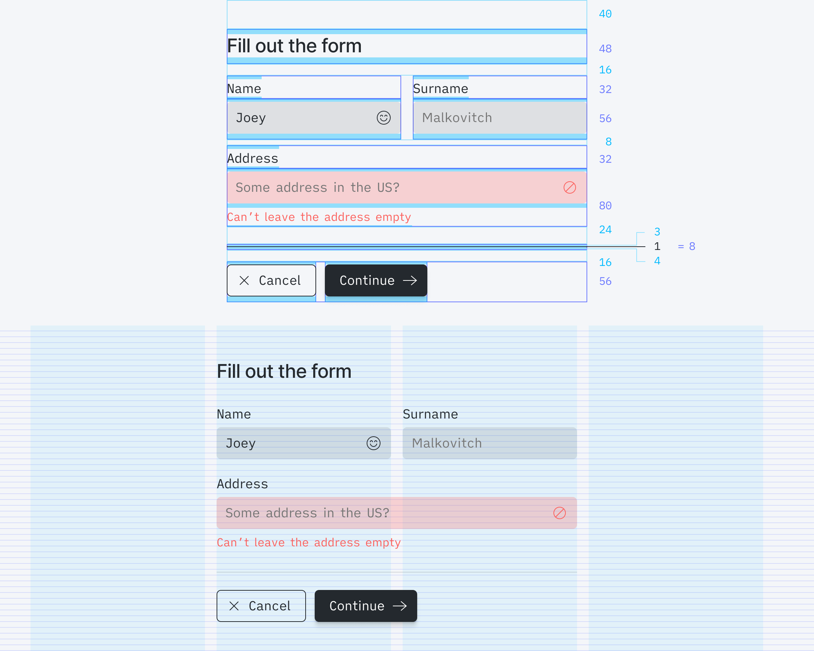

[Check in Figma ->](https://www.figma.com/file/rmvFgJXvCa8bjYaj2iU4PI/Padded-Grid?node-id=871%3A25131)

The Separator container has an 8px height, composed of padding-top of 3px, the size of the separator of 1px, and padding-bottom of 4px.

Note that you don't want to have a line in a 0.5 position to reach pixel perfection. This would render blurry fluffy lines on many devices. So unless you go for 2px height separators for your designs, you'll have to live with tiny uneven paddings ¯\/_(ツ)_/¯


The other advantage of this method is the flexibility to move the line itself freely within the container. For example, for these very tight rows of editable settings, I needed to adjust the separator's position within its container to create an equal spacing between the selectors and the lines.

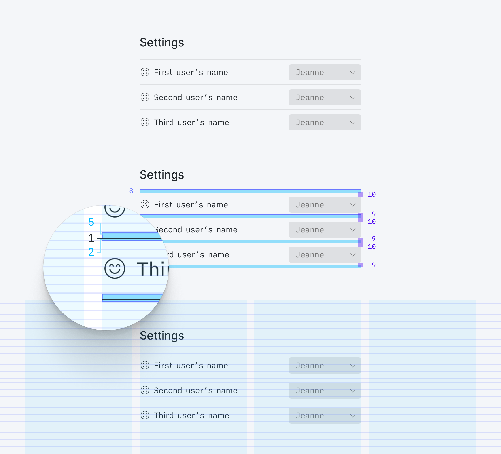

[Check in Figma ->](https://www.figma.com/file/rmvFgJXvCa8bjYaj2iU4PI/Padded-Grid?node-id=871%3A25635)

(Keep in mind that the line itself doesn't need to consider the baseline, only the typography!)

#### Cards

The same thing applies to less complicated components.

I'm using cards to present my projects. It's a combination of an image with a couple of texts.
The cards are forced into an 8px scale height, and the texts are summoned inside with spacers. Typography fits the baseline as always, effortlessly.


[Check in Figma ->](https://www.figma.com/file/rmvFgJXvCa8bjYaj2iU4PI/Padded-Grid?node-id=871%3A26353)


[Check in Figma ->](https://www.figma.com/file/rmvFgJXvCa8bjYaj2iU4PI/Padded-Grid?node-id=871%3A26212)


[Check in Figma ->](https://www.figma.com/file/rmvFgJXvCa8bjYaj2iU4PI/Padded-Grid?node-id=871%3A26348)

#### Devices

I coded a couple of device mockups to present my designs. 
The only minor issue here (apart from making the iPhone looks like one with CSS) was to keep the iPhone screen ratio correct at all times without breaking the 8x8 height rule.

For the browser, well, it's a bit messier. I just have the 8x8 height, my image to fit in on its length – and I have the width truncated however it fits. ¯/\/_(ツ)_/¯ 


[Check in Figma ->](https://www.figma.com/file/rmvFgJXvCa8bjYaj2iU4PI/Padded-Grid?node-id=871%3A26857)

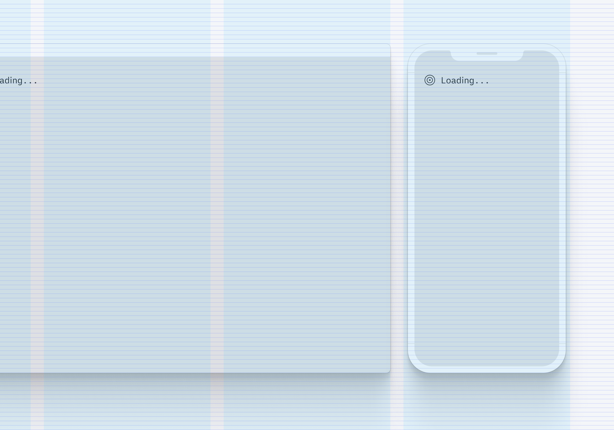

[Check in Figma ->](https://www.figma.com/file/rmvFgJXvCa8bjYaj2iU4PI/Padded-Grid?node-id=871%3A26711)


[Check in Figma ->](https://www.figma.com/file/rmvFgJXvCa8bjYaj2iU4PI/Padded-Grid?node-id=871%3A26850)

#### Images

Same with all the images. Make sure to be imposing a height divisible by 8 for any image container. 


[Check in Figma ->](https://www.figma.com/file/rmvFgJXvCa8bjYaj2iU4PI/Padded-Grid?node-id=871%3A28515)


[Check in Figma ->](https://www.figma.com/file/rmvFgJXvCa8bjYaj2iU4PI/Padded-Grid?node-id=871%3A28370)


[Check in Figma ->](https://www.figma.com/file/rmvFgJXvCa8bjYaj2iU4PI/Padded-Grid?node-id=871%3A28511)

And if you can't accept for your images to have a fixed height, maybe let them go wild but make sure the size is cropped and only scaling gradually by 8px.

To reuse previous truncating principal: `Math.trunc(x/8)*8`

[Link to the Codesandbox demo ->](https://codesandbox.io/s/image-resize-xc1o8?file=/src/App.js)

#### Responsiveness

Nothing really changes because of the mobile version. 
The same Grid is applied, and the same 8x8 and height rule applies. If your components and the fonts have to be smaller, then be it. Redesign them to match your use case. 

That's what I did with most of my components.

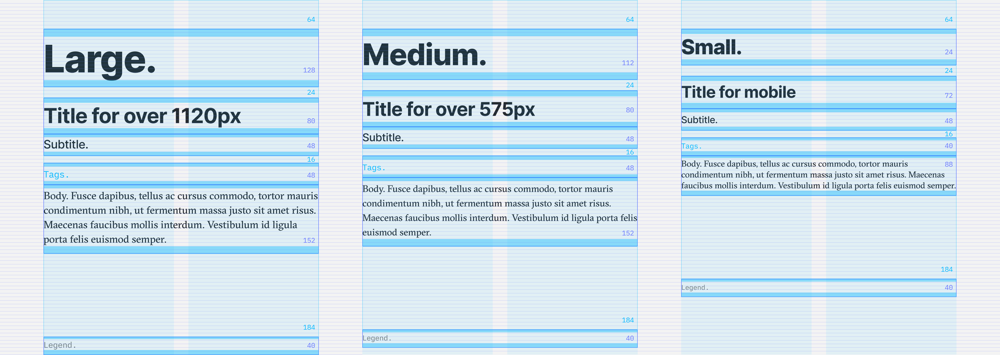

[Check in Figma ->](https://www.figma.com/file/rmvFgJXvCa8bjYaj2iU4PI/Padded-Grid?node-id=881%3A25478)


## Opening up for discussion

So, not sure if I have a conclusion, but I liked working all my components in Figma and React this way. Each component's initial creation and implementation is a bit tedious, but so is creating a Design System from scratch!

You can see all the components I presented in the article on [Figma](https://www.figma.com/file/rmvFgJXvCa8bjYaj2iU4PI/8px-Grid?node-id=724%3A961).

**And you can also see all the components that I made in React on my website – entirely using this Padded Grid system: [dnvt's guidelines](https://dnvt.github.io/dnvt-folio/#/dnvt-folio/guidelines/).**  

Click on the grid icon to reveal the various grids and baselines!


Let me know if you have any questions any suggestions or improvements on this idea/concept. Let me know if you find this totally absurd and the whys. It would also tremendously help the grid discussion.

Thanks for reading! 

✌🏽

---

## Glossary

Some articles about the grid subject, if you want to get some literature on the subject:

- [Baseline grids & design systems ↗️](https://uxdesign.cc/baseline-grids-design-systems-ae23b5af8cec)
- [Text Baseline ↗️](https://alistapart.com/article/settingtypeontheweb/)
- [The good line height ↗️](https://www.thegoodlineheight.com)
- [Hard vs. Soft Grid method ↗️](https://medium.com/sketch-app-sources/hard-and-soft-8-point-grids-60cf803b9de4)
- [From Google DS ↗️](https://www.designsystems.com/space-grids-and-layouts/)
- [The Comprehensive 8pt Grid Guide ↗️](https://medium.com/swlh/the-comprehensive-8pt-grid-guide-aa16ff402179)